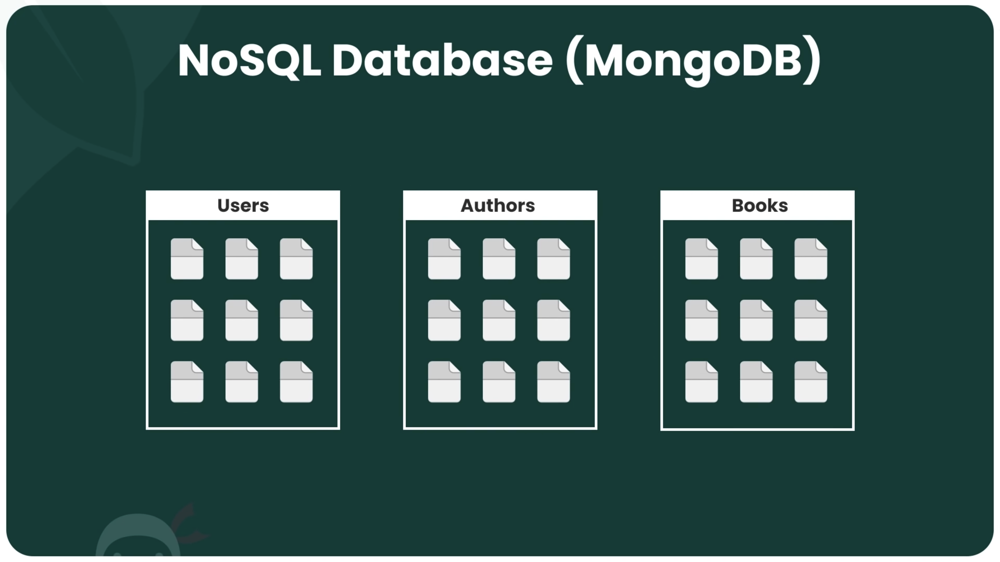

# Complete MongoDB Tutorial

MongoDB is an open source NoSQL database management program. Instead of tables columns and rows, it uses collections and documents.

MongoDB stores data inside of collections. Inside of a collection, there are documents which stores as BSON (Binary JSON). BSON is very similar to JSON and when fetching documents will ultimately return JSON objects.




## 🛠 Installation

https://www.mongodb.com/try/download/community

- MongoDB Community Server
- MongoDB Compass (Only for learning purposes and to visualize the data)
- MongoDB Shell

## 🤖 Basic Commands

```sh
show dbs
```

```sh
use bookstore
```

```sh
cls
```

```sh
db
```

```sh
show collections
```

```sh
help
```

```sh
exit
```

```sh
db.books.insertOne({title: "The Color of Magic", author: "Terry Pratchett", pages: 300, rating: 7, genres: ["fantasy", "magic"]})
```

```sh
db.authors.insertOne({ name: "Brandon Sanderson", age: 60 })
```

```sh
db.books.insertMany([{title: "The Light Fantastic", author: "Terry Pratchett", pages: 250, rating: 6, genres: ["fantasy"]}, {title: "Dune", author: "Frank Herbert", pages: 500, rating: 10, genres: ["sci-fi", "dystopian"]}])
```

```sh
db.books.find()
```

```sh
it
```

```sh
db.books.find({author: "Terry Pratchett"})
```

```sh
db.books.find({author: "Terry Pratchett", rating: 7})
```

```sh
db.books.find({author: "Brandon Sanderson"}, {title: 1, author: 1})
```

```sh
db.books.find({}, {title: 1, author: 1})
```

```sh
db.books.findOne({_id: ObjectId("62e01f0129392a49cc78293b")})
```

```sh
db.books.find().count()
```

```sh
db.books.find({ author: "Brandon Sanderson" }).count()
```

```sh
db.books.find().limit(3).count()
```

```sh
db.books.find().sort({ title: 1 })
```

```sh
db.books.find().sort({ title: 1 }).limit(3)
```

```sh
db.books.insertOne({ title: "The Way of Kings", author: "Brandon Sanderson", rating: 9, pages: 400, genres: ["fantasy"], reviews: [{name: "yoshi", body: "Great book!!"}, {name: "mario", body: "so so"}] })
```

```sh
db.books.insertMany([ { title: 'The Light Fantastic', author: 'Terry Pratchett', pages: 250, rating: 6, genres: ['fantasy', 'magic'], reviews: [ { name: 'Luigi', body: 'It was pretty good' }, { name: 'Bowser', body: 'Loved It!!!' }, ], }, { title: 'The Name of the Wind', author: 'Patrick Rothfuss', pages: 500, rating: 10, genres: ['fantasy'], reviews: [{ name: 'Peach', body: 'One of my favs' }], }, { title: 'The Color of Magic', author: 'Terry Pratchett', pages: 350, rating: 8, genres: ['fantasy', 'magic'], reviews: [ { name: 'Luigi', body: 'It was OK' }, { name: 'Bowser', body: 'Really good book' }, ], }, { title: '1984', author: 'George Orwell', pages: 300, rating: 6, genres: ['sci-fi', 'dystopian'], reviews: [ { name: 'Peach', body: 'Not my cup of tea' }, { name: 'Mario', body: 'Meh' }, ], }, ])
```

```sh
db.books.find({ rating: {$gt: 7} })
```

```sh
db.books.find({ rating: {$lt: 8} })
```

```sh
db.books.find({ rating: {$lte: 8} })
```

```sh
db.books.find({ rating: {$gt: 7}, author: "Patrick Rothfuss" })
```

```sh
db.books.find({ $or: [{rating: 7}, {rating: 9}] })
```

```sh
db.books.find({ $or: [{rating: 7}, {author: "Terry Pratchett"}] })
```

```sh
db.books.find({ $or: [{pages: {$lt: 300}}, {pages: {$gt: 400}}] })
```

```sh
db.books.find({ rating: {$in: [7,8,9]} })
```

```sh
db.books.find({$or: [{rating: 7}, {rating: 8}, {rating: 9}]})
```

```sh
db.books.find({rating: {$nin: [9]}})
```

```sh
db.books.find({genres: "fantasy"})
```

```sh
db.books.find({genres: ["fantasy"]})
```

```sh
db.books.find({genres: ["fantasy", "magic"]})
```

```sh
db.books.find({genres: {$all: ["fantasy", "magic"]}})
```

```sh
db.books.find({"reviews.name": "Luigi"})
```

```sh
db.books.deleteOne({_id: ObjectId("62e40dc7c571c0f6761e9785")})
```

```sh
db.books.deleteMany({author: 'Terry Pratchett'})
```

```sh
db.books.updateOne({_id: ObjectId("62e40dc7c571c0f6761e9785")}, {$set: {rating: 8, pages: 360}})
```

```sh
db.books.updateMany({author: 'Terry Pratchett'}, {$set: {author: 'Terry Pratchet'}})
```

```sh
db.books.updateOne({_id: ObjectId("62e40dc7c571c0f6761e9785")}, {$inc: {pages: 2}})
```

```sh
db.books.updateOne({_id: ObjectId("62e40dc7c571c0f6761e9785")}, {$inc: {pages: -2}})
```

```sh
db.books.updateOne({_id: ObjectId("62e40dc7c571c0f6761e9782")}, {$pull: {genres: 'sci-fi'}})
```

```sh
db.books.updateOne({_id: ObjectId("62e40dc7c571c0f6761e9782")}, {$push: {genres: 'sci-fi'}})
```

```sh
db.books.updateOne({_id: ObjectId("62e40dc7c571c0f6761e9782")}, {$push: {genres: {$each: ['1','2']}}})
```

## 📖 Chapters

1. What is MongoDB?
1. Installing MongoDB
1. Collections & Documents
1. Using MongoDB Compass
1. Using the MongoDB Shell
1. Adding New Documents
1. Finding Documents
1. Sorting & Limiting Data
1. Nested Documents
1. Operators & Complex Queries
1. Using \$in & $nin
1. Querying Arrays
1. Deleting Documents
1. Updating Documents
1. MongoDB Drivers
1. Connecting to MongoDB
1. Cursors & Fetching Data
1. Finding Single Documents
1. Using POSTMAN
1. Handling POST Requests
1. Handling DELETE Requests
1. PATCH Requests
1. Pagination
1. Indexes
1. MongoDB Atlas
